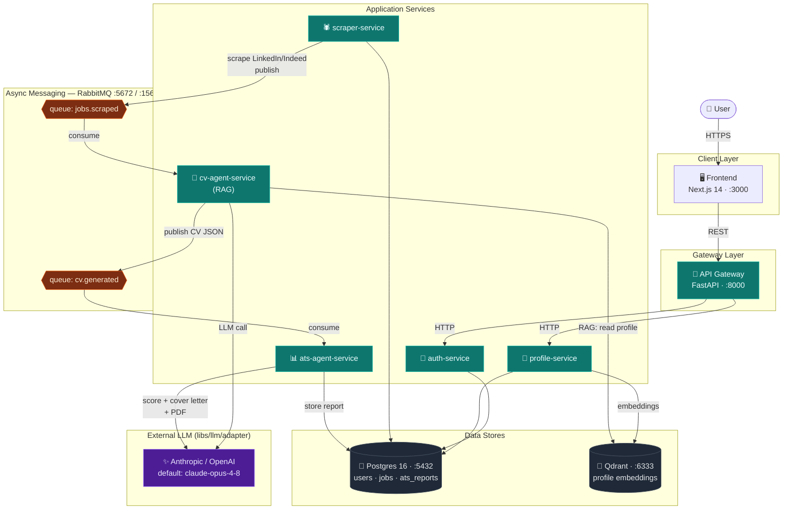
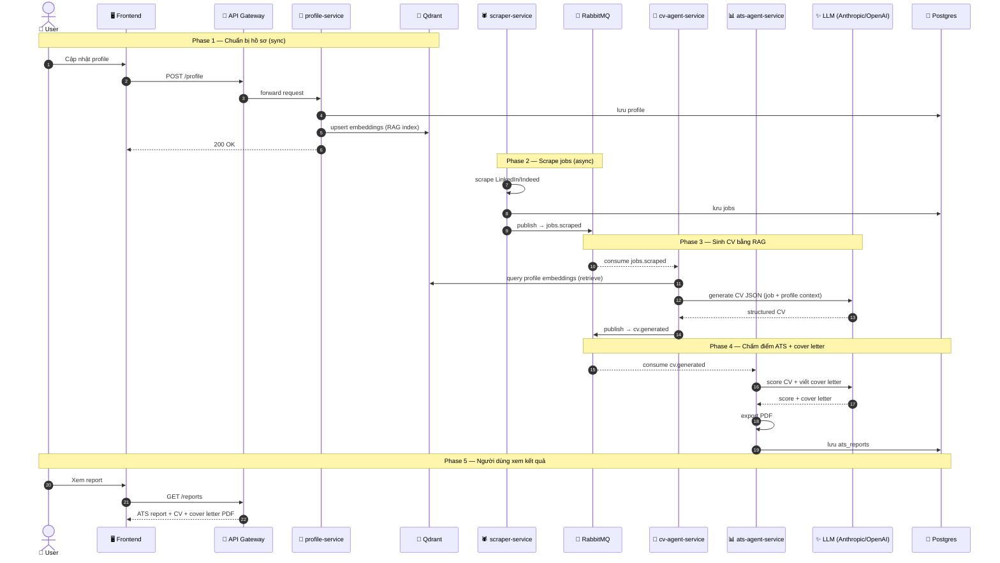

# System Architecture

Kiến trúc microservice cho **Autonomous Career Agent** — nền tảng AI tự động tìm việc và tạo CV, chạy local qua Docker Compose.

- **Sync (HTTP):** Frontend → API Gateway → các service nghiệp vụ.
- **Async (RabbitMQ):** pipeline `scraper → cv-agent → ats-agent` qua 2 queue.
- **Data:** Postgres (quan hệ) + Qdrant (embedding cho RAG).
- **LLM:** gọi ra ngoài qua `libs/llm/adapter` (Anthropic mặc định `claude-opus-4-8`, hoặc OpenAI).

## Component Diagram

## Sequence Diagram — End-to-End Flow

Từ lúc người dùng cập nhật hồ sơ đến khi có ATS report hoàn chỉnh.

## Ghi chú

- **Không có cross-import giữa các service.** Giao tiếp đồng bộ chỉ qua API Gateway; giao tiếp bất đồng bộ chỉ qua RabbitMQ.
- **Queue names** khai báo tập trung tại `libs.messaging.rabbitmq` (`QUEUE_JOBS_SCRAPED`, `QUEUE_CV_GENERATED`).
- **Shared models** (`Job`, `ProfileData`, `GeneratedCV`, `ATSReport`) tại `libs.schemas.models`.
- **Config** duy nhất qua `libs.common.config.settings` — không đọc `os.environ` trực tiếp.
- Mọi service đều expose `GET /health`.
