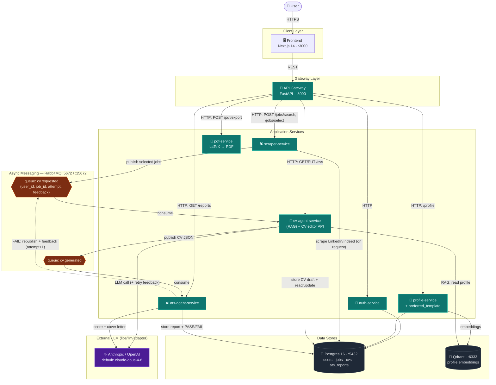
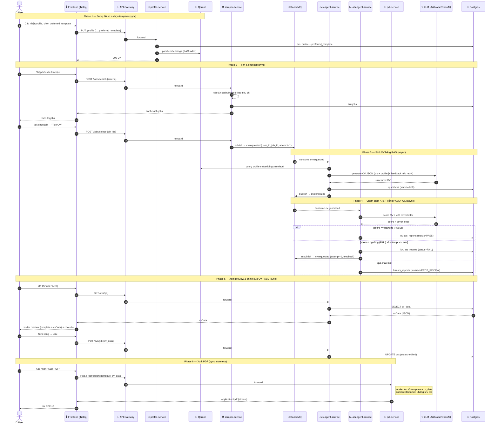

# System Architecture

Kiến trúc microservice cho **Autonomous Career Agent** — nền tảng AI tự động tìm việc và tạo CV, chạy local qua Docker Compose.

- **Sync (HTTP):** Frontend → API Gateway → các service nghiệp vụ.
- **Async (RabbitMQ):** pipeline `scraper → cv-agent → ats-agent` qua 2 queue.
- **Data:** Postgres (quan hệ) + Qdrant (embedding cho RAG).
- **LLM:** gọi ra ngoài qua `libs/llm/adapter` (Anthropic mặc định `claude-opus-4-8`, hoặc OpenAI).

## Component Diagram

## Sequence Diagram — End-to-End Flow

Từ lúc setup hồ sơ (chọn template) → tìm & chọn job → sinh CV → chấm điểm (có vòng retry) → chỉnh sửa → xuất PDF.

## Ghi chú

- **Không có cross-import giữa các service.** Giao tiếp đồng bộ chỉ qua API Gateway; giao tiếp bất đồng bộ chỉ qua RabbitMQ.
- **Queue names** khai báo tập trung tại `libs.messaging.rabbitmq` (`QUEUE_CV_REQUESTED`, `QUEUE_CV_GENERATED`). *(Đổi tên `jobs.scraped` → `cv.requested` vì message giờ mang `user_id, job_id, attempt, feedback`.)*
- **Shared models** (`Job`, `ProfileData`, `GeneratedCV`, `ATSReport`) tại `libs.schemas.models`.
- **Config** duy nhất qua `libs.common.config.settings` — không đọc `os.environ` trực tiếp (vd `ATS_PASS_THRESHOLD`, `ATS_MAX_ATTEMPTS`).
- Mọi service đều expose `GET /health`.
- **`scraper-service` sở hữu bảng `jobs`**: (1) **API đồng bộ** `POST /jobs/search` (cào theo tiêu chí → trả jobs) và `POST /jobs/select` (publish job user chọn vào `cv.requested`); nó là **producer** của queue `cv.requested`.
- **`ats-agent-service` sở hữu bảng `ats_reports`** và đảm nhiệm: (1) **consumer** nghe `cv.generated` → chấm điểm + cover letter, ghi report với `status = PASS | FAIL | NEEDS_REVIEW`; **FAIL** thì republish `cv.requested` (attempt+1, kèm weaknesses/advice), quá `ATS_MAX_ATTEMPTS` thì `NEEDS_REVIEW`; (2) **read API** `GET /reports`. ats **không** ghi vào bảng `cvs` (tránh ghi chéo bảng).
- **`cv-agent-service` sở hữu bảng `cvs`** và đảm nhiệm hai vai trò: (1) **consumer** nghe `cv.requested` → sinh CV bằng RAG (dùng feedback nếu là retry) → upsert `cvs` (`status=draft`) → publish `cv.generated`; (2) **read/update API** (`GET/PUT /cvs/{id}`) phục vụ CV Editor (`status` chuyển `edited` khi user lưu).
- **`pdf-service` là stateless** — nhận `{template, cv_data}` qua HTTP, compile LaTeX (`.tex`) → PDF và stream về, **không lưu file**. PDF luôn tái tạo được từ `cv_data` (bảng `cvs`) + `preferred_template` (profile).
- **`preferred_template`** (`classic|modern|academic`) là thuộc tính của profile, do `profile-service` quản lý; user chọn lúc setup profile và **cố định** cho CV Editor.
