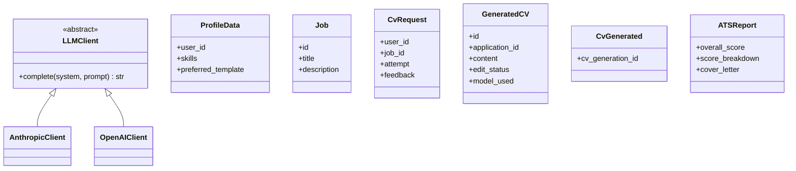
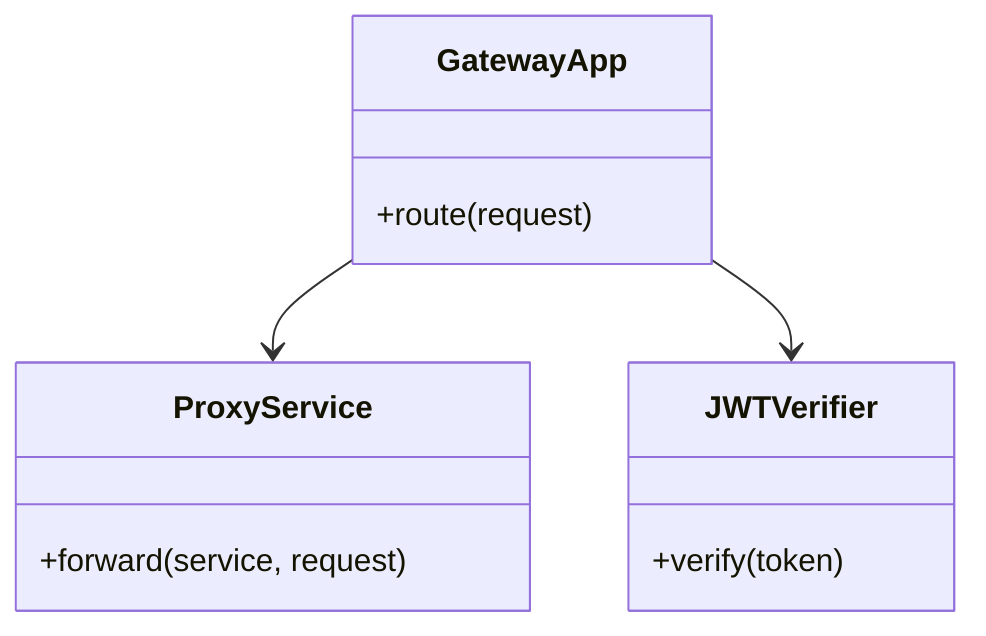
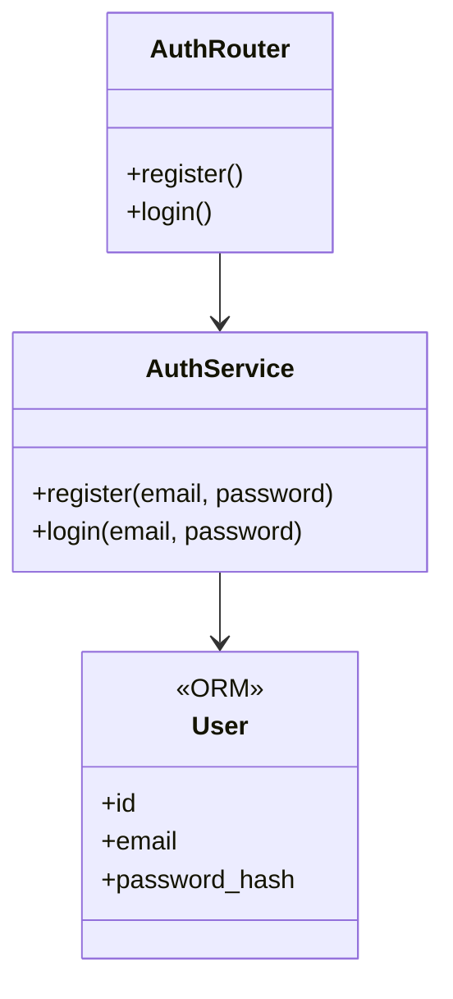
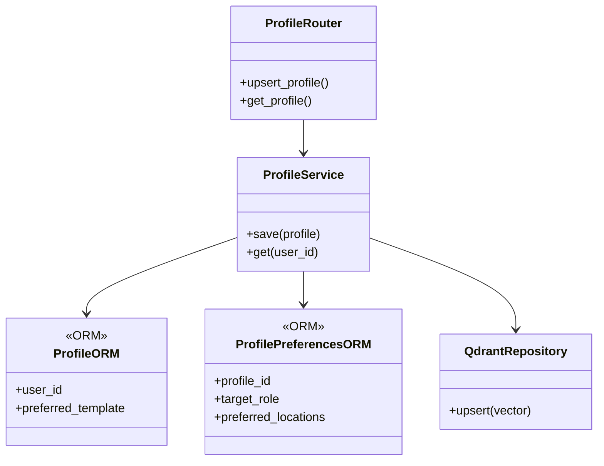
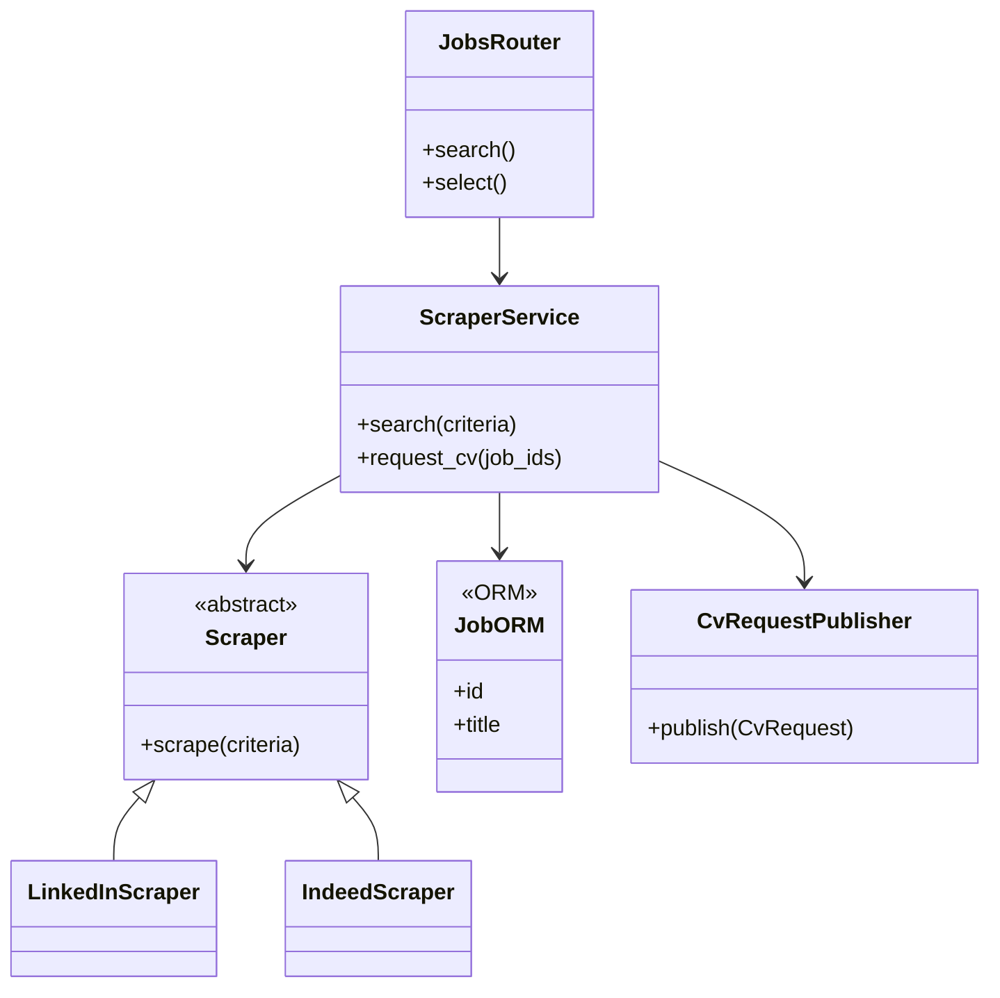
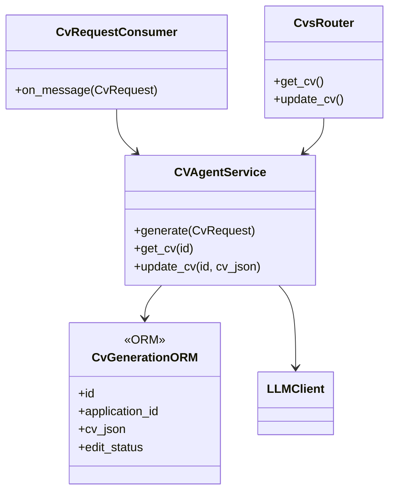
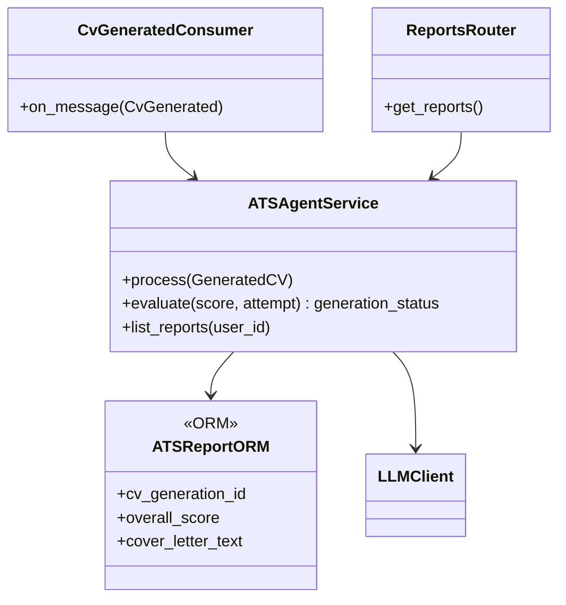
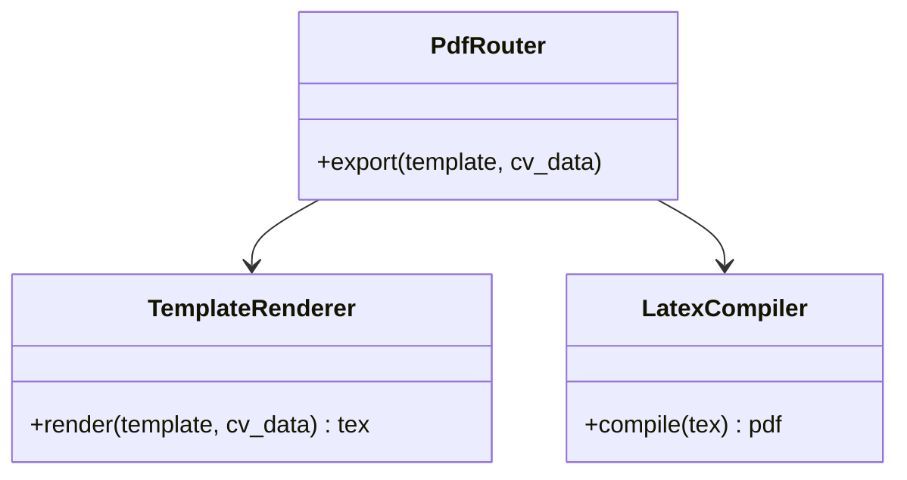
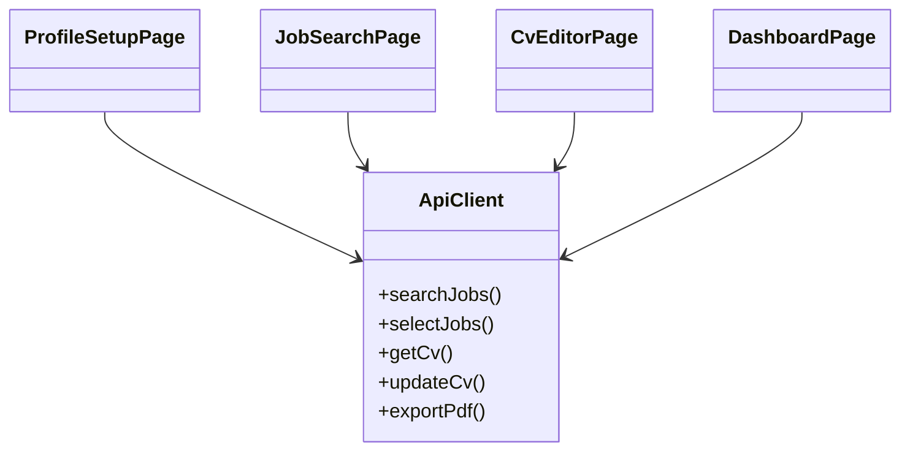

# Class Diagrams

Class diagram (thiết kế mục tiêu, rút gọn) cho từng component của **Autonomous Career Agent**, bám theo [ARCHITECTURE.md](ARCHITECTURE.md) và spec [CV Editor + LaTeX PDF Export](superpowers/specs/2026-07-18-cv-editor-pdf-latex-design.md).

Mỗi service theo cùng kiến trúc phân tầng: **Router** (`api/`) → **Service** (`services/`, chứa business logic) → **ORM** (`models/`). Các diagram dưới đây chỉ hiển thị class cốt lõi; helper nhỏ được gộp thành method của service.

> **Lưu ý:** code hiện mới ở mức scaffold; đây là thiết kế mục tiêu theo spec.

## Mục lục

- [0. Foundation — `libs/`](#0-foundation--libs)
- [1. api-gateway](#1-api-gateway)
- [2. auth-service](#2-auth-service)
- [3. profile-service](#3-profile-service)
- [4. scraper-service](#4-scraper-service)
- [5. cv-agent-service](#5-cv-agent-service)
- [6. ats-agent-service](#6-ats-agent-service)
- [7. pdf-service](#7-pdf-service)
- [8. frontend](#8-frontend)

## 0. Foundation — `libs/`

Model dữ liệu dùng chung + LLM client, được mọi service tham chiếu.

## 1. api-gateway

Chỉ routing + verify JWT, forward mọi request tới service nghiệp vụ.

## 2. auth-service

Đăng ký / đăng nhập / cấp JWT. Sở hữu bảng `users`.

## 3. profile-service

Lưu hồ sơ + `preferred_template`, index embedding cho RAG.

## 4. scraper-service

Tìm/chọn job (sync) và **publish** job đã chọn vào `cv.requested`. Sở hữu bảng `jobs`.

## 5. cv-agent-service

Consumer `cv.requested` → sinh CV (RAG, dùng feedback khi retry) → lưu `cvs` → publish `cv.generated`. Kèm API đọc/sửa CV. Sở hữu bảng `cvs`.

## 6. ats-agent-service

Consumer `cv.generated`: chấm điểm + cover letter, quyết định PASS/FAIL/NEEDS_REVIEW; FAIL → republish `cv.requested`. Read API `/reports`. Sở hữu bảng `ats_reports`.

## 7. pdf-service

Stateless: nhận `{template, cv_data}` → render `.tex` → compile → stream PDF.

## 8. frontend

Mọi call qua `ApiClient` (→ API Gateway); các page dùng chung client.

