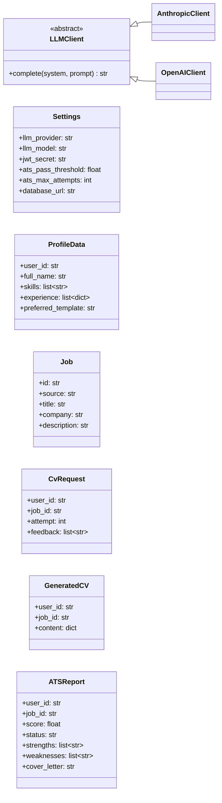
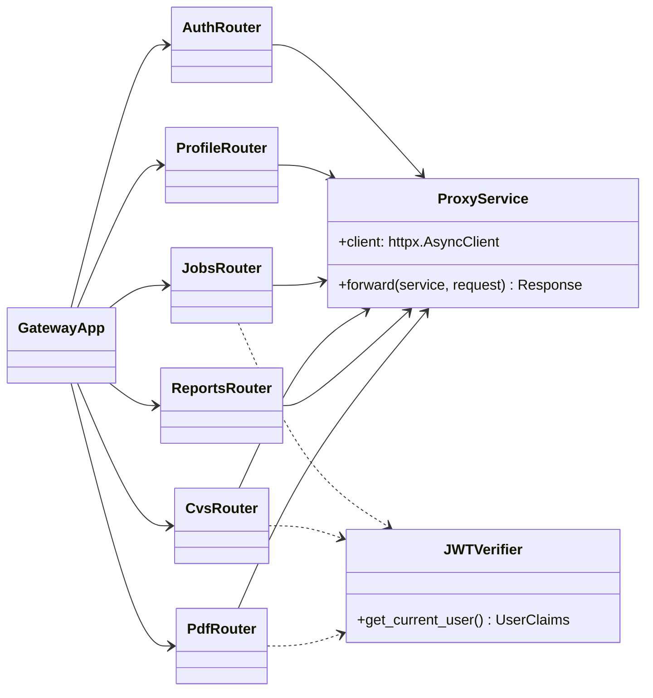
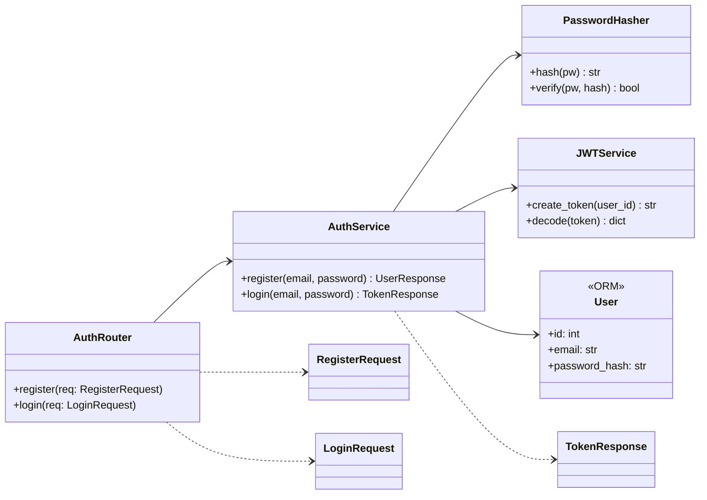
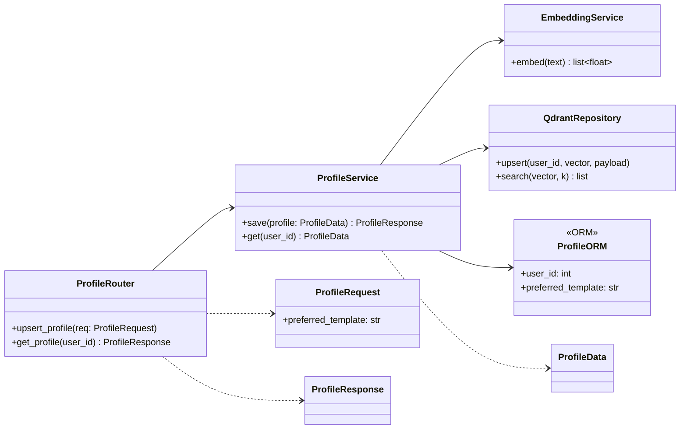
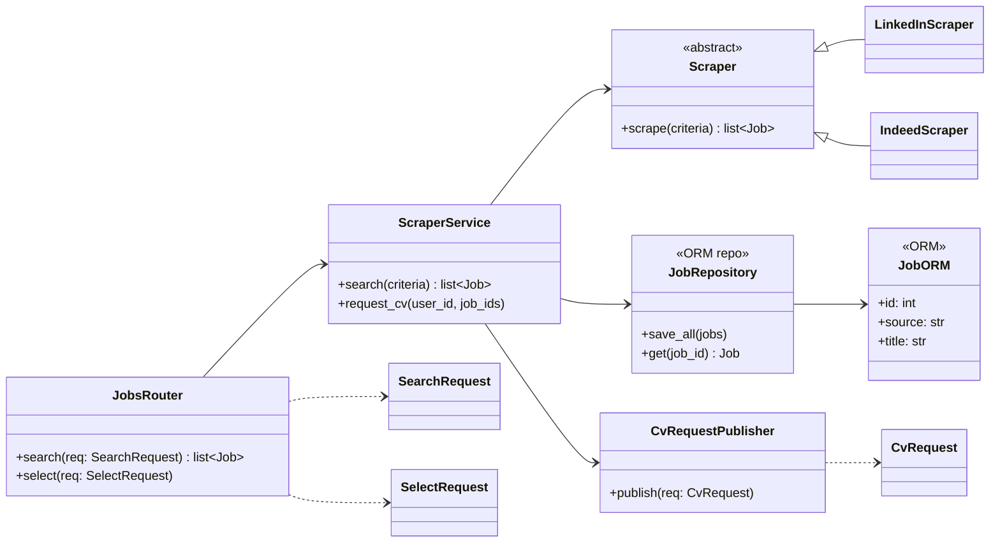
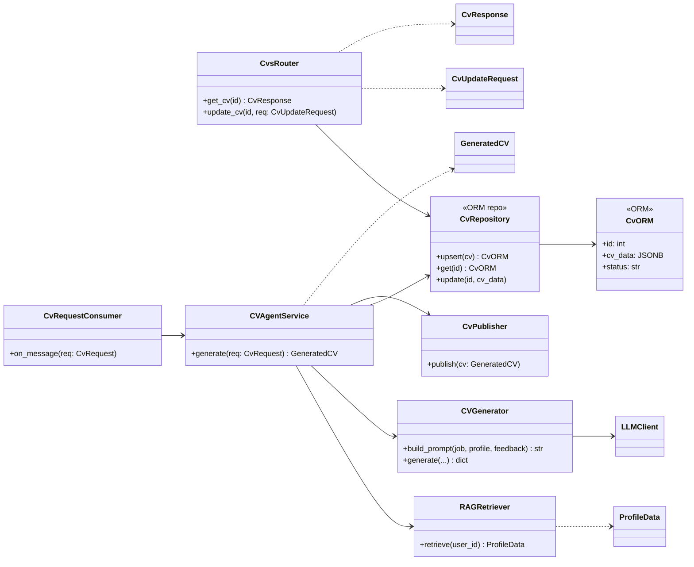
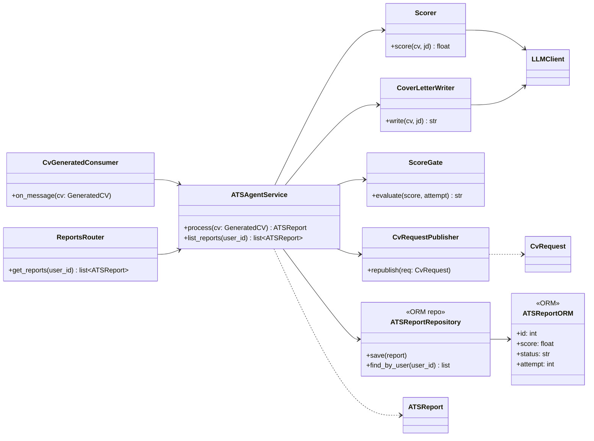
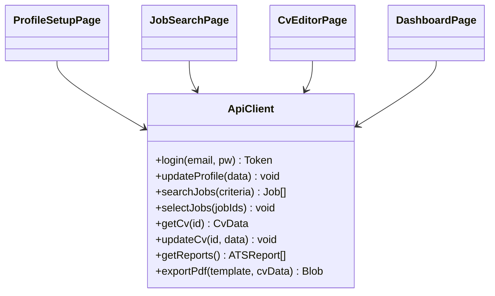

# Class Diagrams

Class diagram (thiết kế mục tiêu) cho từng component của **Autonomous Career Agent**, bám theo [ARCHITECTURE.md](ARCHITECTURE.md) và spec [CV Editor + LaTeX PDF Export](superpowers/specs/2026-07-18-cv-editor-pdf-latex-design.md).

Mỗi service theo cùng kiến trúc phân tầng — các class ánh xạ theo thư mục:

| Tầng (`app/`) | Loại class | Ví dụ |
|---|---|---|
| `models/` | SQLAlchemy entity (ORM) | `User`, `JobORM`, `CvORM` |
| `schemas/` | Pydantic DTO (request/response) | `LoginRequest`, `ExportRequest` |
| `api/` | Router (thin handler) | `AuthRouter`, `CvsRouter` |
| `services/` | Business logic | `AuthService`, `Scorer` |
| `core/` | Dependency dùng chung | `get_db`, `get_current_user` |

> **Lưu ý:** code hiện tại mới ở mức scaffold; các class ở tầng `services/`/`models/` là thiết kế mục tiêu theo spec. Khi implement thật, cập nhật lại diagram cho khớp.

## Mục lục

- [0. Foundation — `libs/`](#0-foundation--libs)
- [1. api-gateway](#1-api-gateway)
- [2. auth-service](#2-auth-service)
- [3. profile-service](#3-profile-service)
- [4. scraper-service](#4-scraper-service)
- [5. cv-agent-service](#5-cv-agent-service)
- [6. ats-agent-service](#6-ats-agent-service)
- [7. pdf-service](#7-pdf-service)
- [8. frontend](#8-frontend)

## 0. Foundation — `libs/`

Nền tảng dùng chung, được tham chiếu bởi mọi service.



## 1. api-gateway

Routing + verify JWT; không có business logic. Mọi router chỉ forward qua `ProxyService`.



## 2. auth-service

Đăng ký / đăng nhập / cấp JWT. Sở hữu bảng `users`.



## 3. profile-service

Lưu hồ sơ + `preferred_template`, index embedding cho RAG.



## 4. scraper-service

API sync tìm/chọn job; **producer** của queue `cv.requested`. Sở hữu bảng `jobs`.



> `CvRequestPublisher` đẩy vào queue `cv.requested`.

## 5. cv-agent-service

Consumer `cv.requested` (dùng `feedback` khi retry) → upsert `cvs` → publish `cv.generated`; kèm read/update API cho CV Editor. Sở hữu bảng `cvs`.



## 6. ats-agent-service

Consumer `cv.generated`: chấm điểm + cover letter + cổng PASS/FAIL/NEEDS_REVIEW; FAIL → republish `cv.requested`. Read API `/reports`. Sở hữu bảng `ats_reports`.



> `ScoreGate` quyết định `PASS | FAIL | NEEDS_REVIEW`; FAIL → `CvRequestPublisher.republish` vào `cv.requested` với `attempt+1` + feedback.

## 7. pdf-service

Stateless: nhận `{template, cv_data}` → render `.tex` → compile (tectonic) → stream PDF.

```mermaid
classDiagram
    direction LR
    class PdfRouter {
        +export(req: ExportRequest) bytes
    }
    class TemplateRenderer {
        +render(template, cv_data) str
        +escape_latex(value) str
    }
    class LatexCompiler {
        +compile(tex) bytes
    }
    class ExportRequest {
        +template: str
        +cv_data: dict
    }

    PdfRouter --> TemplateRenderer
    PdfRouter --> LatexCompiler
    PdfRouter ..> ExportRequest
    TemplateRenderer ..> "classic|modern|academic .tex.j2"
```

## 8. frontend

Next.js/TypeScript không hợp class diagram — model tầng `lib/api.ts` + các page.


